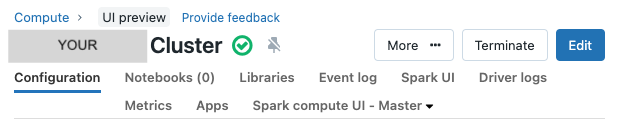

# Edit Databricks Cluster Configuration

1. Under **Compute**, click on your cluster, and then click the big **Edit** button:

2. Change any available settings to the desired values and click **Confirm and Restart** at the bottom.