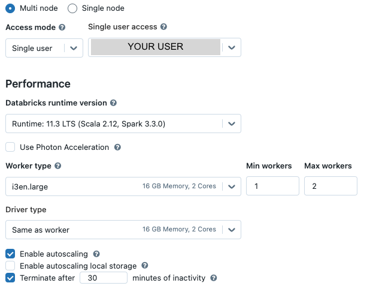

# Set up a Databricks Cluster

For any workload in Databricks, you'll need a cluster. You can create a cluster (menu item: Create > Cluster) either through the UI or using JSON. Pick whichever is easiest for you!
* [Through the UI](#through-the-ui)
* [Using JSON](#using-json)

## Through the UI



## Using JSON
   ```json
     {
      "autoscale": {
         "min_workers": 1,
         "max_workers": 2
      },
      "cluster_name": "your-awesomely-named-cluster", ---> change this!
      "spark_version": "10.4.x-scala2.12",
      "spark_conf": {},
      "aws_attributes": {
         "first_on_demand": 1,
         "availability": "SPOT_WITH_FALLBACK",
         "zone_id": "eu-central-1a", ---> change this! (NA: us-east-1a, Europe: eu-central-1a, India: ap-south-1c)
         "instance_profile_arn": null,
         "spot_bid_price_percent": 100,
         "ebs_volume_count": 0
      },
      "node_type_id": "i3en.large",
      "ssh_public_keys": [],
      "custom_tags": {},
      "spark_env_vars": {
         "PYSPARK_PYTHON": "/databricks/python3/bin/python3"
      },
      "autotermination_minutes": 60,
      "enable_elastic_disk": false,
      "cluster_source": "UI",
      "init_scripts": [],
      "runtime_engine": "STANDARD"
   } 
   ```
