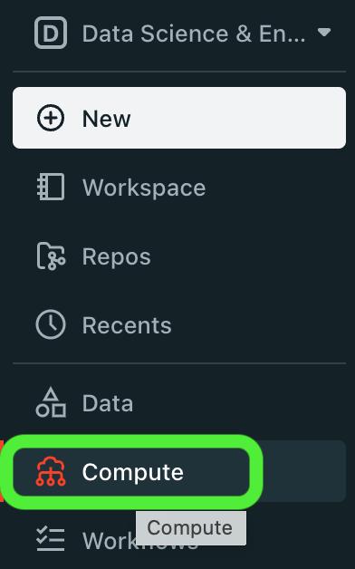
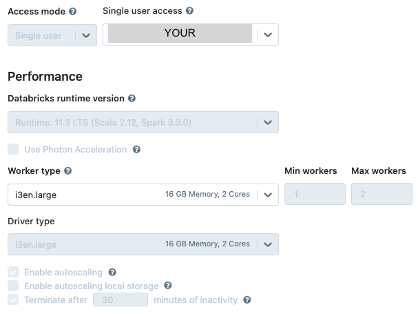

# Set up a Databricks Single User Cluster

For any workload in Databricks, you'll need a cluster. This particular cluster allows a single individual to access it and comes enabled with Unity Catalog. You can create a cluster (menu item: Create > Cluster) through the UI.

## Through the UI

1. Choose `Compute` in the left navigation:

2. Create a cluster with the following parameters (:bulb: there may be a pre-existing cluster policy with these exact parameters):

4. Confirm by clicking the `Create Cluster` button at the bottom of the page.
