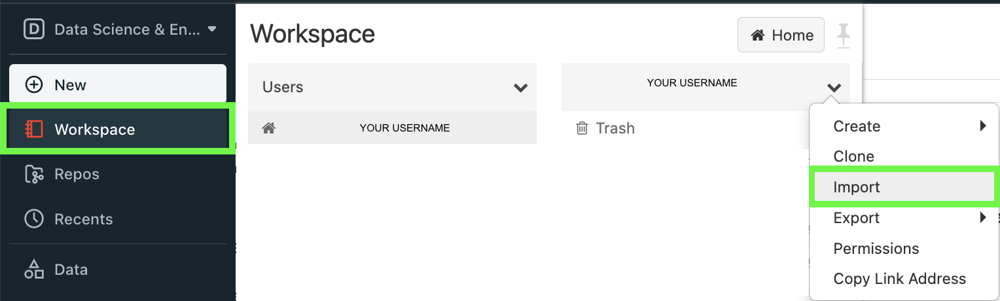

# Start using Databricks
1. [Set up a cluster](./setup-cluster.md)
1. In your User's workspace, click import

   

2. Import your desired notebook by either dragging a file from your local machine or importing using a url (for example: `https://raw.githubusercontent.com/data-derp/exercise-co2-vs-temperature-databricks/master/data-ingestion/Data%20Ingestion%20CO2%20vs%20Temperature.py`)

   

3. Select your cluster

   

5. Follow instructions in your notebook (or create one on your own!)